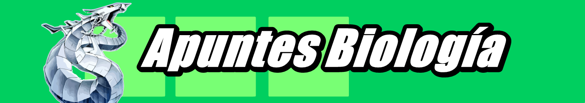

[//]: <> (Página del Preuniversitario Fabimath)

# Informaciones actuales
Preuniversitario Fabimath es un preuniversitario solidario online decidido a formular la mejor preparación para las pruebas de selección
universitarias. Dentro del preuniversitario encontraras, material, ejercicios, zona de consultas y preparación enfocada para estudiantes
que quieren entrar a carreras copadas (ingenierías y medicina).
# ¿Quienes Somos?
 
# Horarios 

# ¿Cómo unirse a la clase?

# Apuntes Y Repeticiones

