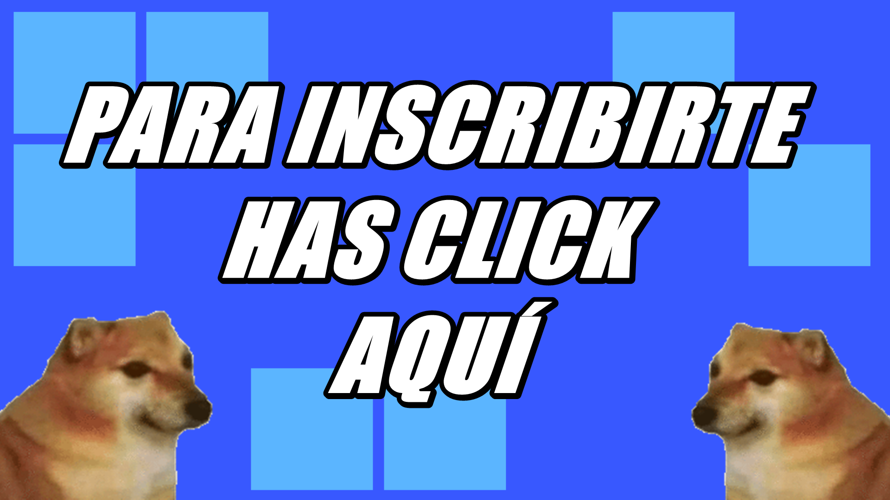
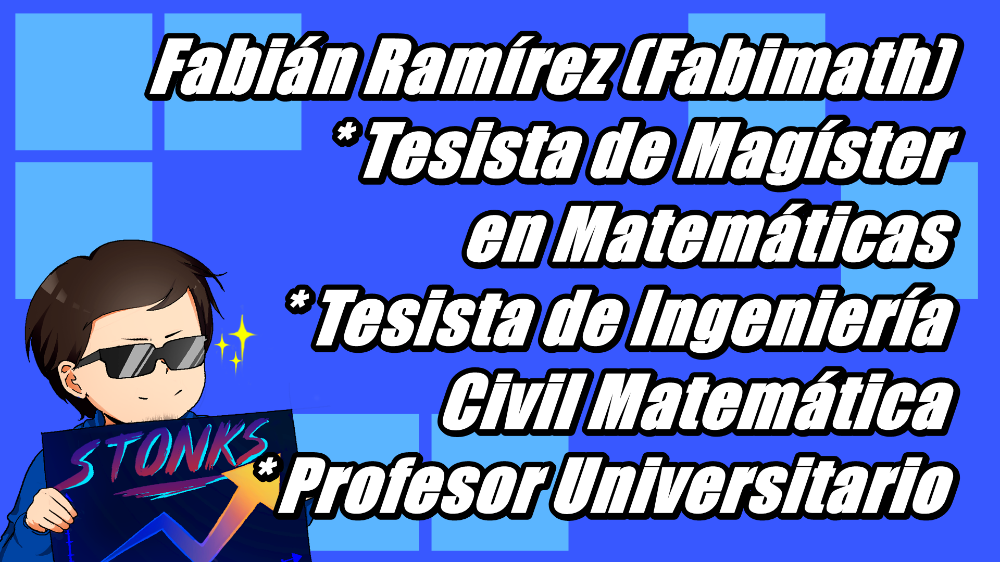
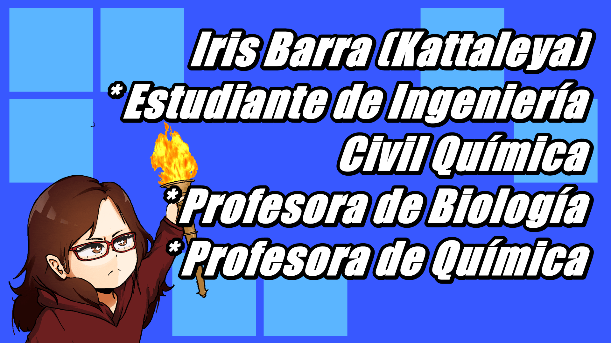

[//]: <> (Página del Preuniversitario Fabimath)

# Informaciones actuales

Preuniversitario Fabimath es un preuniversitario solidario online decidido a formular la mejor preparación para las pruebas de selección
universitarias. Dentro del preuniversitario encontraras, material, ejercicios, zona de consultas y preparación enfocada para estudiantes
que quieren entrar a carreras copadas (ingenierías y medicina).

# ¿Cómo Postular?

# ¿Quienes Somos?

# Horarios 
Por definir

# ¿Cómo unirse a la clase?

Sólo tienes que meterte a este link los días de clases

* [https://twitch.tv/fabimath](https://twitch.tv/fabimath)

* [Has click aquí para unirte al grupo de Discord](https://discord.gg/TR8rrZG3GV)

